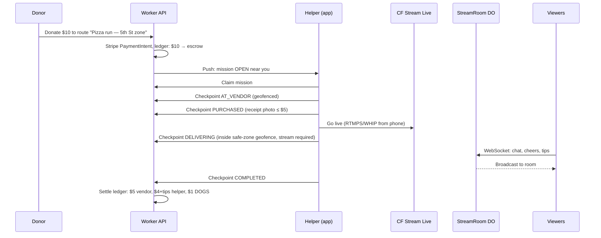
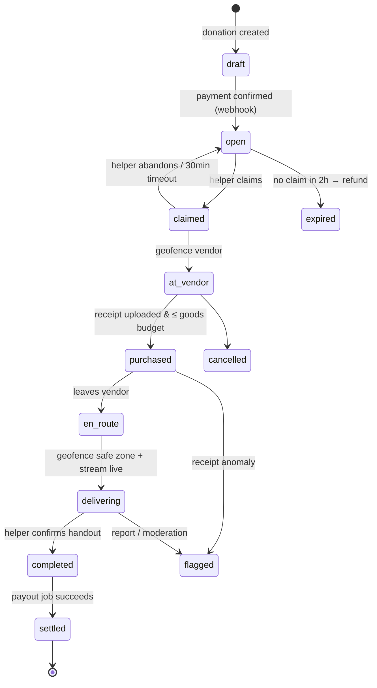
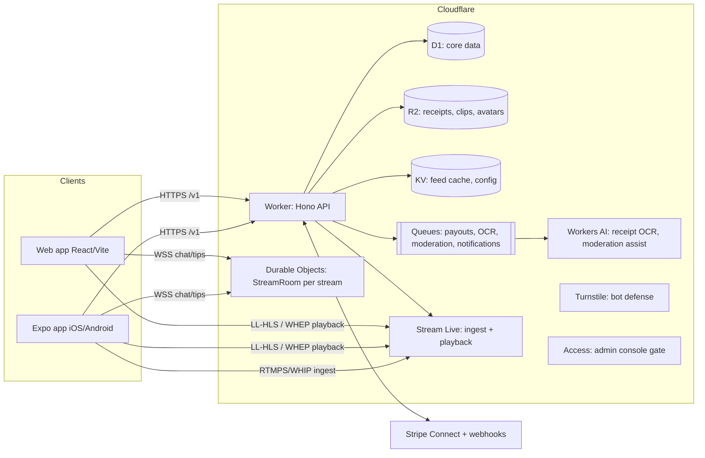

# help — Architecture

## 1. What the product is

Donation-funded micro-missions of direct aid, executed by paid gig helpers, broadcast live. Five actors:

| Actor | What they do | What they get |
|---|---|---|
| **Donor** | Funds a mission ($10 default) | Watches their donation happen, live |
| **Helper** | Claims a mission, buys goods, delivers to a safe zone on stream | $4 per mission + viewer tips |
| **Vendor** | Sells the goods (e.g. Little Caesars) | $5 of the donation |
| **Viewer** | Scrolls a TikTok-style feed of helper streams | Comments, cheers, tips |
| **DOGS (platform)** | Vets helpers and safe zones, hosts everything | $1 per mission + pass-through on tips |

Recipients — the people being helped — are deliberately **not** users of the system. They have no account, owe nothing, and are protected by the dignity policy in `docs/trust-and-safety.md` (short version: the camera points at the helper and the food, never at a recipient without explicit consent, and faces are blurred by default).

## 2. The core loop

Every state transition is validated by a shared state machine (`packages/shared/src/mission.ts`) so mobile, web, and API can never disagree about what's allowed next.

## 3. Mission state machine

Checkpoints carry evidence: GPS fix (checked server-side against vendor/zone radius), receipt photo (R2 upload, OCR via Workers AI in a Queue consumer), and live-stream status (checked against Cloudflare Stream's API). A helper cannot advance state from the couch.

## 4. System overview — all on Cloudflare

### Why each piece

- **Workers + Hono** — the API is a single Worker at the edge; Hono is the de-facto router for Workers, tiny and typed. No servers, no regions to pick, donor/viewer latency is good everywhere.
- **D1 (SQLite)** — core relational data: users, missions, ledger, streams. Right-sized for MVP; the schema is plain SQL so the migration path to Postgres via **Hyperdrive** (Neon/Supabase) is mechanical if write volume outgrows D1. Geo queries are bounding-box + haversine in the Worker (no PostGIS in D1) — fine at city scale.
- **Durable Objects — one `StreamRoom` per live stream** — the real-time heart. Each room is a single-threaded coordination point holding all viewer WebSockets (hibernation API, so idle rooms cost ~nothing), broadcasting chat/cheers/tips, and maintaining the authoritative viewer count. This is exactly the workload DOs exist for; doing it with polling or pub/sub-over-D1 would be worse in every way.
- **Cloudflare Stream Live** — helpers go live via RTMPS or **WHIP** (WebRTC ingest — works from a phone browser and from React Native); viewers watch via LL-HLS, or **WHEP** for sub-second latency on the currently-focused stream. Stream handles transcoding, recording (VOD clips for the feed), and thumbnails. We never touch video bytes.
- **R2** — receipt photos, VOD clips we want to own, avatars. Zero egress fees matters for a video-adjacent product.
- **Queues** — everything async and retryable: receipt OCR, payout execution, moderation scans, push-notification fanout. Keeps request handlers fast and makes money-moving jobs idempotent and replayable.
- **KV** — feed-page cache (the feed is read-heavy and tolerant of ~30s staleness) and runtime config/flags.
- **Workers AI** — first-pass receipt OCR (does the amount match? is it from the right vendor?) and stream-frame moderation assist. Humans review everything it flags; see trust-and-safety doc.
- **Turnstile** — on signup, donation, and tipping endpoints.
- **Cloudflare Access** — gates the DOGS admin console (zone vetting, helper approval, moderation queue) with zero auth code.
- **Workers static assets** — serves the web app from the same Worker platform (successor to Pages for new projects).

### What is *not* Cloudflare

**Payments are Stripe.** Cloudflare has no money-movement product. Stripe Connect (Express accounts for helpers) handles KYC, payouts, and tips. Details and the ledger design are in `docs/payments.md` — the one-line summary: **the platform keeps its own double-entry ledger in D1 as the source of truth**, and Stripe is the execution rail. MVP reimburses helpers against verified receipts; v2 issues per-mission virtual cards (Stripe Issuing) so helpers never front their own money.

## 5. Livestream + feed design (the TikTok part)

- **Feed** = vertical pager (scroll-snap on web, `FlatList` paging on mobile) mixing **live streams first**, then recent VOD clips. Ranking v1 is transparent: live > proximity > recency > engagement. Served from KV cache, refreshed by a cron Worker.
- **Playback strategy**: the focused card plays via WHEP (sub-second, feels "live with you"); off-screen neighbors pre-warm LL-HLS manifests. Muted autoplay, tap to unmute — identical mental model to TikTok Live.
- **Room interaction**: on focus, the client opens one WebSocket to `wss://api/v1/streams/:id/ws`, which the Worker forwards into that stream's `StreamRoom` DO. Messages: `chat`, `cheer` (free, animated), `tip` (paid — client hits the HTTP tip endpoint, and after payment succeeds the API pokes the DO so the room sees the tip banner). Viewer count is DO-authoritative and broadcast on join/leave.
- **Clips**: when a stream ends, Stream's recording becomes the feed VOD; a Queue job trims a highlight (first pass: the delivery-checkpoint timestamp ± 60s).

## 6. Data model (D1)

Full DDL in `apps/api/migrations/0001_init.sql`. The load-bearing tables:

- `users` — one table, `role` flags (donor/helper/admin are additive; every helper is also a viewer).
- `helper_profiles` — KYC state, Stripe account id, approval state, strike count.
- `vendors` — name, lat/lng, geofence radius, receipt-matching hints.
- `safe_zones` — DOGS-vetted drop areas: lat/lng + radius, active hours, vetting notes, `status` (proposed → vetted → suspended).
- `routes` — a vendor × zone pairing with a price card (`goods_cents`, `helper_cents`, `platform_cents`). "$10 pizza run" is a route.
- `donations` — donor, route, amounts, Stripe payment ref, status.
- `missions` — the state machine row: route, donation, helper, timestamps per checkpoint, receipt object key, stream id.
- `ledger_entries` — append-only double-entry rows (`account`, `debit/credit`, `amount_cents`, `mission_id`). Money truth lives here.
- `streams` / `stream_events` — Stream Live input ids, status, and persisted chat/tip events (DO is the hot path; events flush to D1 for history and clips).
- `tips`, `follows`, `reports` — as expected.

## 7. Clients

- **Mobile (`apps/mobile`)** — Expo React Native, one codebase for iOS + Android. Helpers need: mission list/claim, checkpoint flow with camera (receipts) and GPS, go-live (WHIP publish). Viewers need: vertical feed, WebSocket chat, tipping. Expo keeps native modules (camera, location, push) manageable; kept **outside** npm workspaces on purpose — Metro + hoisting is more trouble than it's worth.
- **Web (`apps/web`)** — React + Vite, deployed as Worker static assets. Viewers/donors first-class; helper tooling is mobile-only (you can't deliver a pizza from a laptop).
- **Shared (`packages/shared`)** — mission state machine, money math (integer cents only), and API types. The API imports it directly; web imports types; mobile mirrors it until the workspace story is settled.

## 8. Auth

MVP: phone/email OTP issuing a signed session JWT, verified in the Worker (`lib/auth.ts` currently ships a dev-token stub with the real seam marked). Helpers additionally pass Stripe Identity + DOGS approval before they can claim. Admin surface sits behind Cloudflare Access — no app-level admin auth at all.

## 9. Scaling notes & known limits

- **D1 write ceiling** — the ledger and stream_events are the hot writers. stream_events batch-flush from DOs; if mission volume 100×s, move ledger+missions to Postgres/Hyperdrive. Schema is vanilla SQL for exactly this reason.
- **One DO per stream** shards naturally; a single mega-viral stream (~30k+ sockets in one room) would need a fan-out tier (one relay DO per ~5k viewers). Not an MVP problem; noted so it isn't a surprise.
- **Feed ranking** starts as a cron-built KV document per metro area. A real ranking service is a later, isolated concern.
- **Stream costs** scale with minutes watched — the feed should prefer WHEP only for the focused card, HLS elsewhere.

## 10. Build order (proposed)

1. **M0 — money + missions, no video**: donations, claim, geofenced checkpoints, receipt upload, ledger, manual payouts. This is the actual product risk.
2. **M1 — go live**: Stream Live ingest/playback, StreamRoom chat/cheers, feed of live streams.
3. **M2 — the loop**: tips, VOD clips in feed, follows, push notifications.
4. **M3 — hardening**: Stripe Issuing cards, moderation pipeline, admin console, multi-metro.
