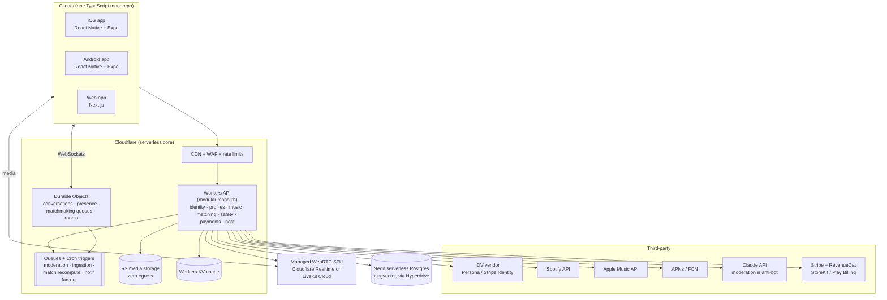
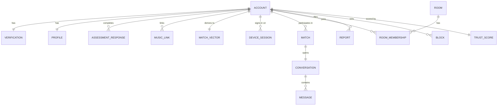

# SDM Architecture

**SDM — Sex, Drugs, Music. A dating app by DOGS.**

SDM is an ID-verified place to find new friends and partners based on sexual
preferences, music taste, and recreational vices. Less swiping, more talking:
random text/voice/video chat, chatrooms, and deep compatibility matching built
from assessments (BDSM test, personality, astrology, porn preferences, drug
preferences) and deep Spotify/Apple Music integration. AI keeps spam and bots
out; every account is backed by a valid US ID.

This document lays out the system architecture: the constraints that shape it,
the major components, the data model, and the phased plan to build it.

---

## 1. Product pillars → architectural drivers

| Product pillar | What it forces architecturally |
| --- | --- |
| ID-verified, 18+, US-only | Third-party identity verification (IDV) at signup; hard gate before any social feature; geo-fencing; we must *not* become a warehouse of government IDs |
| Extremely sensitive profile data (kinks, drug use, porn prefs) | Tiered data classification, field-level encryption, pseudonymized matching, aggressive data minimization, real deletion |
| Less swiping, more talking | Real-time is the core product, not a bolt-on: chat, random 1:1 matching (text/voice/video), chatrooms — all first-class |
| AI against spam/bots | Risk scoring at signup and continuously; ML moderation pipeline over text/media; verification signals feed trust score |
| Deep music integration | OAuth to Spotify/Apple Music, ingestion + refresh pipeline, taste embeddings as first-class matching features |
| Matching on many weird axes | Feature-vector + embedding based matching service, decoupled from the profile store, tunable weights per user |

### Non-goals (v1)

- No marketplace or any facilitation of buying/selling anything (especially
  drugs — preferences are a compatibility signal, transactions are a ban).
- No user-generated adult media feeds (porn *preferences* are questionnaire
  data, not content hosting).
- No international launch. US-only simplifies IDV, compliance, and moderation.
- No native desktop apps. Mobile-first, web second.

---

## 2. High-level system



**Shape: a modular monolith on serverless compute.** One Workers codebase
with strictly separated internal modules (identity, profiles, music,
matching, conversations, safety, payments, notifications), one Postgres
database with per-module schemas. Module boundaries are enforced in code —
no cross-module DB access, communicate via interfaces and events — so a
module can later be split into its own Worker (or a container, see the
escape hatch below) as a deploy change, not a rewrite. Stateful realtime
lives in Durable Objects; async work rides Queues and Cron triggers.

### Clients & code reuse

iOS and Android come first, web close behind, and the goal is one team
shipping all three from **one TypeScript monorepo** (pnpm + Turborepo):

```
apps/
  mobile/        Expo (React Native) — iOS + Android from one codebase
  web/           Next.js — app + marketing (landing folds in here)
packages/
  api/           Workers backend (deployable)
  api-client/    tRPC client + generated types — shared by all apps
  core/          domain logic: validation, match-preference models,
                 assessment scoring, entitlement checks — pure TS, no UI
  ui/            design system on Tamagui — renders native on RN,
                 DOM on web, one component source
  config/        shared tsconfig/eslint/tokens
```

What's actually shared, realistically:

- **~100%** of types, API client, domain logic, state management
  (TanStack Query + Zustand), i18n, analytics events.
- **~80–90%** of screens/components via Tamagui (React Native + web from
  one source). Truly platform-specific surfaces — camera/ID-scan flow,
  push permission prompts, IAP sheets, WebRTC views — get platform files
  (`.native.tsx` / `.web.tsx`).
- **Not shared:** app-store metadata, native config, deep-link setup.

Expo specifics: EAS Build + Updates (OTA fixes without store review),
`expo-av`/WebRTC libs for calls, vendor SDKs (IDV, RevenueCat) have RN
modules. The web app is Next.js rather than Expo-web because marketing/SEO
pages and the existing landing site want a real web framework; Tamagui is
what keeps the two from diverging.

### Compute: serverless — and the two places it can't be

A dating app is a good serverless fit, with exceptions. Mapping every
workload honestly:

| Workload | Serverless-friendly? | Runs on |
| --- | --- | --- |
| Auth, profiles, assessments, CRUD API | Yes — classic request/response | Workers |
| IDV, Stripe, music-provider webhooks | Yes — bursty, event-driven | Workers |
| Moderation pipeline, music ingestion, match recompute | Yes — queue consumers | Queues + Workers (Cron for batches) |
| Chat: persistent WebSockets, presence, typing | **Needs state + long-lived connections** | Durable Objects — one DO per conversation/room; WebSocket Hibernation means idle connections cost ~nothing |
| Random-chat matchmaking queue | **Needs a coordinator** | Durable Objects — one DO per queue shard, pairing in memory |
| Voice/video (SFU media routing) | **Never serverless, on any cloud** | Buy it: Cloudflare Realtime or LiveKit Cloud; we only mint room tokens |
| Heavy ML inference | Long-running GPU work doesn't fit | Buy it: Claude API for nuanced text, Workers AI for cheap classifiers, vendor APIs for image/CSAM scanning |

So the answer to "can we make a dating app serverless?" is: **everything
except the SFU, and the SFU is a product you buy, not a server you run.**
No fleet to patch, scale-to-zero pricing while user count is small, and no
3 a.m. pager for a full chat host.

**Escape hatch, stated up front:** Durable Objects are the one real
Cloudflare lock-in (the rest is portable TS + Postgres + S3-compatible
storage). If some future workload needs a long-running process (self-hosted
LiveKit, an in-house ML service, a heavy batch), it goes in a container on
Fly.io or Cloud Run and joins the system over the same event bus — the
architecture doesn't assume Workers-only forever.

### Why Cloudflare (vs AWS / GCP / Azure)

The costs that kill small realtime + media apps are **idle infrastructure**
and **egress bandwidth**. Comparing the four for *this* app:

| | Cloudflare | AWS | GCP | Azure |
| --- | --- | --- | --- | --- |
| Serverless compute | Workers — $5/mo plan, per-request pricing, no cold-start pain | Lambda — fine, but API GW + NAT + ALB add fixed cost | Cloud Run — best container serverless, scale-to-zero | Functions — weakest DX of the four |
| Persistent WebSockets | **Durable Objects, native + hibernation** | API GW WebSockets + DynamoDB — workable, clunky, per-message cost | Cloud Run supports WS but you pay for held instances | Web PubSub — extra service |
| Media egress | **R2: $0 egress** | ~$0.09/GB out of S3/CloudFront | ~$0.08–0.12/GB | ~$0.08/GB |
| Idle floor (no users) | ~$5–10/mo | Realistically $50–150/mo (NAT GW, ALB, RDS min) | ~$20–50/mo | ~$50+/mo |
| Managed Postgres | None native → Neon (serverless, scale-to-zero) via Hyperdrive | RDS/Aurora — solid, ~$30+/mo min | Cloud SQL/AlloyDB — ~$30+/mo min | Flexible Server |
| Verdict | **Primary: cheapest by far, realtime-native** | Most mature; overkill + overpriced at our stage | **Runner-up** — Cloud Run if we outgrow Workers' model | Not a fit |

Rough monthly spend, honestly guessed and dominated by third parties, not
compute: **private alpha** (hundreds of users) ≈ $30–80 for all of
Cloudflare + Neon + LiveKit Cloud dev tier — IDV verification fees
(~$1–2/user, one-time) will be the biggest line. **Launch** (tens of
thousands MAU) ≈ mid-hundreds/month, with media minutes (SFU) and AI
moderation calls as the growth lines — both usage-priced, both scale with
revenue-bearing users. There is no five-figure infra cliff in this design.

### Stack

| Layer | Choice | Why |
| --- | --- | --- |
| Mobile | React Native + Expo (EAS) | iOS + Android from one codebase; OTA updates; team is JS-native |
| Web | Next.js, sharing `ui`/`core`/`api-client` packages via Tamagui | Real web framework for app + SEO/marketing; max reuse with mobile |
| API | TypeScript on Cloudflare Workers — Hono + tRPC | End-to-end types with the clients; serverless; modular monolith |
| Realtime messaging | Durable Objects (WebSocket Hibernation) | Per-conversation/room/queue coordinators; presence; typing; no gateway fleet |
| Voice/video | Cloudflare Realtime (SFU) — LiveKit Cloud as fallback if features fall short | Managed media; we mint short-lived room tokens |
| Primary DB | Neon serverless Postgres + `pgvector`, via Hyperdrive | Relational core + embeddings; scale-to-zero in dev; branch-per-PR |
| Cache / queues | Workers KV + Cloudflare Queues + Cron; Upstash Redis only if a gap appears | Serverless-native; no Redis to run |
| Object storage | R2 + Cloudflare Images | Photos/voice notes behind signed URLs; **zero egress fees** |
| Payments | Stripe (web) + StoreKit / Play Billing (mobile), unified by RevenueCat | See §3.8 — app stores mandate IAP for in-app digital goods |
| AI | Claude API (nuanced moderation, anti-bot) + Workers AI (cheap high-volume classifiers) | Buy the hard NLP; keep per-message cost near zero |
| Infra as code | Terraform + Wrangler | Everything declarative; US-only data residency settings |
| Observability | Workers Analytics + OpenTelemetry export; Sentry (clients + API) | Traces across Workers/DOs/Queues |

---

## 3. Domains

### 3.1 Identity & Verification

The front door and the most sensitive integration in the system.

**Flow:**

1. Signup with phone number (SMS OTP) → account exists in `pending` state.
2. Client hands off to the IDV vendor SDK (Persona or Stripe Identity):
   government ID scan + liveness selfie, vendor-side.
3. Vendor webhook returns a verdict. We persist only **derived attestations**:
   - `is_verified: bool`
   - `age_over_18: bool` (and birth year for age-range display)
   - `id_state: US state` (for geo/compliance)
   - `verification_vendor_ref` (opaque pointer into vendor's system)
4. Account transitions to `active`; until then, zero social surface area.

**Hard rules:**

- **We never store ID document images, ID numbers, or selfie biometrics.**
  The vendor retains them under their compliance regime; we hold a pointer.
- Legal name from the ID is *not* the display name and is not stored beyond
  what the vendor keeps. SDM identities are handles.
- One verified human ↔ one account, enforced via vendor-side duplicate/face
  dedup checks (their feature, not our biometric DB).
- Re-verification triggers: account recovery, ban evasion suspicion, ID
  expiry horizon.

Auth is standard: short-lived JWT access tokens + rotating refresh tokens,
device-bound sessions, per-device revocation.

### 3.2 Profiles & Assessments

Two distinct data planes, deliberately separated:

- **Public profile** — handle, photos, age range, distance bucket, bio,
  top artists/genres, astrology sign, and whichever assessment results the
  user *chooses to display*. Served from the normal profile store.
- **Preference vault** — raw assessment answers: BDSM test results,
  personality inventory, porn preferences, drug preferences (weed, alcohol,
  psychedelics, cocaine, etc. — frequency/attitude scales, not logistics),
  dealbreakers and seeking-filters. Stored in a separate Postgres schema with
  **field-level encryption** (per-user data keys via KMS envelope encryption).

Assessments are versioned questionnaires (`assessment`, `assessment_version`,
`response`) so tests can evolve without invalidating history. Each assessment
compiles down to a **trait vector** (see Matching) — the vault's raw answers
never leave the vault; only derived vectors and user-chosen display badges do.

Visibility is per-field, three levels: `public` · `matches only` · `private
(matching signal only)`. Default for everything in the vault: **private**.

### 3.3 Music Integration

- OAuth to **Spotify** (Web API) and **Apple Music** (MusicKit). Store
  provider refresh tokens encrypted; scopes limited to listening
  history/top items/playlists — read-only.
- Ingestion worker pulls top artists, top tracks, genres, and audio-feature
  distributions (energy, valence, danceability…) on link and on a weekly
  refresh; normalizes both providers into one internal taste schema.
- Produces a **taste embedding** per user (genre/artist vectors + audio
  features), stored in `pgvector`. Also powers profile flair: top artists,
  "on repeat," compatibility bars on other profiles, shared-artist callouts
  in chat ("you both play Turnstile").
- Token revocation or unlink → purge ingested history, keep only the
  (regenerable) embedding if the user opts to freeze it, else drop it.

### 3.4 Matching

A read-side service over derived features — it never touches raw vault data.

**Inputs per user (the match vector):**

- Trait vectors from assessments (BDSM/kink compatibility is *directional* —
  e.g. dominant/submissive complements rather than similarity).
- Music taste embedding (similarity).
- Vice profile (similarity + tolerance filters: "I don't partake but don't
  care" vs "dealbreaker").
- Astrology (a fun low-weight prior; weight user-tunable to zero).
- Logistics: distance bucket, age window, intent (friends / dating / both),
  seeking preferences (genders, orientations).
- Trust score from Trust & Safety (low-trust accounts get throttled reach).

**Scoring:** hard filters first (dealbreakers, age, distance, intent,
blocked/reported pairs), then a weighted compatibility score mixing
complement-based kink matching, cosine similarity on music/personality, and
vice tolerance. Weights are user-tunable sliders ("music matters most to
me"), with sane defaults learned later from conversation-outcome data
(matches that led to sustained conversation = positive label).

**Serving:**

- **Discovery** — a short daily/periodic batch of high-score candidates
  (this is the "less swiping" stance: a handful of good matches, not an
  infinite deck). Precomputed by a worker into a per-user queue.
- **Random chat matchmaking** — a live queue held in Durable Objects
  (sharded by mode/coarse filters): users opt into random text/voice/video
  with optional filters; the coordinator pairs the best currently-waiting
  candidates within a latency budget (relaxing score thresholds as wait
  time grows), then hands off to Conversations.

### 3.5 Conversations (DMs, random chat, chatrooms, voice/video)

- **DMs** open on mutual match (or after a random-chat session where both tap
  "keep talking"). Text + voice notes + photos; all media through the
  moderation pipeline before delivery.
- **Random chat** — ephemeral 1:1 sessions from the matchmaker. Text
  sessions ride the conversation Durable Object; voice/video sessions get an
  SFU room. Either side can end/skip/report; "keep talking" from both
  converts it to a DM thread, otherwise the session content expires on a
  short TTL.
- **Chatrooms** — interest-based rooms (genres, scenes, kinks, cities).
  Public rooms are AI-plus-human moderated; capacity-limited voice rooms via
  the SFU. Room discovery keys off the same taste/trait features.
- **Transport:** each conversation/room is a Durable Object that owns its
  WebSocket connections, ordering, presence, and typing state (Hibernation
  keeps idle connections nearly free); messages persist to Postgres
  (partitioned by conversation) with delivery receipts. Voice/video is
  negotiated per-session through the managed SFU with short-lived room
  tokens minted by the API.
- Blocking is absolute and bidirectional across every surface: matching,
  rooms, random-chat queue (blocked pairs can never be paired again).

### 3.6 Trust & Safety (the AI layer)

Runs as both an inline gate and a continuous background process.

- **Signup risk scoring** — device fingerprint, phone reputation, IDV
  signals, behavioral velocity. High risk → step-up verification or shadow
  throttle before the account reaches anyone.
- **Bot/spam detection** — continuous behavioral models (message cadence,
  template similarity, link patterns, mass-contact patterns) + LLM
  classification of suspect conversations. Verified-ID requirement already
  removes cheap bot farms; this layer catches the rest.
- **Content moderation pipeline** — every message, bio, photo, and voice
  note passes async classification (fast local classifiers for volume, Claude
  for nuanced text, vision models + hash-matching for imagery). Policy tiers:
  block, blur-with-consent (e.g. NSFW images between consenting matched
  adults), queue for human review, or pass.
- **Consent tooling** — NSFW media requires recipient opt-in per
  conversation; first-message constraints; in-chat panic actions
  (end + block + report in one tap).
- **Hard policy lines encoded in the pipeline:** any facilitation of drug
  *sales* (detection of solicitation/transaction patterns) → removal + ban;
  CSAM → hash-match + immediate NCMEC report per legal requirements;
  non-consensual content, harassment, off-platform doxxing → escalation
  queue with human review and audit trail.
- **Trust score** feeds back into matching reach and rate limits, so
  enforcement is graduated rather than binary.

### 3.7 Notifications

Standard worker-driven fan-out: APNs/FCM push, in-app inbox, email (magic
links, digest). Preference-gated per category. Notification *content* is
privacy-conscious by default: lock-screen pushes never include message text or
match names unless the user opts in ("Someone new wants to talk" vs the
actual content).

### 3.8 Payments & Premium

**The constraint that shapes everything here:** Apple and Google require
their own in-app purchase systems (StoreKit / Play Billing, 15–30% cut) for
digital goods bought *inside* the apps. Stripe cannot be the in-app payment
sheet on mobile. Stripe *is* the right processor for the web app, and — in
the US, under the post-2025 anti-steering rules — for purchases the iOS app
links out to. So the design is multi-processor from day one:

- **RevenueCat** in front of all three (Stripe, StoreKit, Play Billing):
  one SDK in the clients, one webhook stream to the backend, one place
  subscriptions/renewals/refunds are reconciled. This is the standard play
  and removes an entire class of receipt-validation code.
- **Entitlements service** (a module in the monolith) is the only source of
  truth the product ever consults: `entitlements(account_id) → {tier,
  features, expiry}`. Product code checks entitlements; it never looks at
  processor state. Webhooks (via RevenueCat) update entitlements; clients
  get a push-refreshed local copy.
- Stripe specifics: Checkout + Billing for web subscriptions, Customer
  Portal for self-serve management, webhooks into the payments module.
  **Action item before build:** SDM's sex-adjacent branding needs an early
  conversation with Stripe about their restricted-business categories —
  dating/matchmaking is generally fine, adult *content* is not; get written
  clarity rather than discovering it at scale.
- Tax: Stripe Tax on web; the app stores handle their own.

**Premium model — one subscription tier ("SDM Backstage"), no consumables.**
Principles: never sell outcomes (no pay-per-match, no paid super-likes, no
"see who likes you" ransom mechanics — that's the dark-pattern economy SDM
is positioned against), sell *capacity and control*:

| Free | Backstage |
| --- | --- |
| Daily match batch | Larger batch + on-demand refresh |
| Standard filters | Advanced filters (deeper assessment axes, tolerance nuance) |
| Random chat | Priority matchmaking queue + more skips/hour |
| Default match weights | Fully tunable weight sliders |
| — | Incognito browsing (visible only to people you've liked) |
| — | Read receipts (mutual-opt-in), profile-view insights (aggregated, never "who") |
| Standard music flair | Full taste-compatibility breakdowns |

Verification (IDV) stays free — charging for the safety gate would
undermine it. Entitlement checks live in `core` (shared package), so free/
premium gating renders identically on all three clients.

---

## 4. Data architecture

### Classification tiers

| Tier | Examples | Handling |
| --- | --- | --- |
| T0 — never stored | ID documents, ID numbers, biometrics | Live only at the IDV vendor; we store attestations + a vendor ref |
| T1 — vault | Assessment answers, kink/porn/drug preferences, provider OAuth tokens | Separate schema, field-level envelope encryption (KMS), access only via the vault module, full audit log |
| T2 — private | Messages, match history, location (coarse, geohash — never raw GPS at rest), trust signals | Encrypted at rest, row-level access checks, TTLs where applicable |
| T3 — member-visible | Profile, photos, displayed badges, room posts | Normal handling, still auth-gated (no public crawlable profiles) |

### Core entities (simplified)



Notes:

- `MATCH_VECTOR` is fully **derived** — rebuildable from vault + music data,
  disposable, and the only thing the matching service reads.
- Messages partitioned by conversation id + time; random-chat sessions that
  don't convert expire via TTL.
- Deletion is real: account deletion tombstones the account, purges vault,
  vectors, media, and provider tokens, revokes vendor data where the API
  allows, and leaves only the minimum legally-required moderation/audit
  records, time-boxed.

### Events

Postgres outbox → Cloudflare Queues. Key events: `account.verified`,
`profile.updated`, `assessment.completed`, `music.synced`,
`match.created`, `message.flagged`, `report.filed`, `trust.score_changed`.
Workers (moderation, matching recompute, notifications, analytics) are all
consumers — nothing user-facing blocks on them.

---

## 5. Security & privacy posture

- **Minimize, then encrypt.** The best defense for a database of kinks and
  vices is not having one where avoidable: attestations instead of IDs,
  derived vectors instead of raw answers in hot paths, coarse geohash instead
  of GPS coordinates.
- Envelope encryption (KMS) for T1; per-user data keys so a single-user purge
  is also a cryptographic erase.
- All media behind signed, expiring URLs; EXIF stripped on upload.
- Internal access: no standing prod access; vault reads audited; support
  tooling shows T2/T3 only, never T1.
- Anonymous-by-default social layer: handles, age *ranges*, distance
  *buckets*. Nothing links an SDM handle to a legal identity in-product.
- Rate limiting + WAF at the edge; per-device and per-account limits inside;
  screenshot deterrence where platforms allow, honesty about its limits.
- Compliance workstream (with counsel, not just engineering): state age-
  verification laws, CCPA/state privacy acts (access/delete/export rights are
  API-level features from day one), SMS (TCPA), CSAM reporting obligations,
  app-store policy review for the 18+ category — plus, existentially:
  **Visa/Mastercard and app-store rules for adult-adjacent products** shape
  what monetization and content are possible. Involve payments/policy experts
  before building billing.

---

## 6. Build phases

Aligned with the public roadmap (building through 2026, more info 2027).

**Phase 1 — Verified core (MVP, private alpha)**
Signup + IDV attestation flow · profiles + first two assessments (music
handled manually via Spotify link only) · discovery batch matching ·
text DMs over Durable Objects · block/report + baseline moderation
pipeline · deletion that actually deletes. *Goal: prove the verified,
high-trust loop end to end.*

**Phase 2 — The fun parts (beta)**
Full Spotify + Apple Music ingestion and taste matching · BDSM/personality/
vice/astrology assessment suite with per-field visibility · random text chat
matchmaking · trust scoring + AI anti-bot in the loop · push notifications.

**Phase 3 — Talking out loud (launch)**
Voice/video random chat + SFU rooms · chatrooms with AI+human moderation ·
tunable match weights · consent-gated media · monetization: Backstage
subscription via RevenueCat + Stripe + store IAP (§3.8) — never
pay-per-match dark patterns.

**Phase 4 — Scale-out (post-launch)**
Extract hot modules (matching, messaging) into services as load demands ·
dedicated vector store if pgvector tops out · learned match-weight defaults
from conversation outcomes · regional expansion *only* after the compliance
groundwork exists.

---

## 7. Open questions

1. **IDV vendor selection** — Persona vs Stripe Identity vs Plaid IDV: price
   per verification, face-dedup support, and their data-retention/deletion
   guarantees are the deciding axes.
2. **Cloudflare Realtime vs LiveKit Cloud for the SFU** — Realtime keeps
   the stack single-vendor and cheap; LiveKit has the richer room/recording
   feature set. Needs a spike before Phase 3; self-hosting only ever via
   the container escape hatch.
3. **Assessment licensing** — the well-known BDSM/personality tests have
   owners; license, partner, or build our own instruments.
4. **Payments risk review** — architecture is settled (§3.8: RevenueCat
   over Stripe + store IAP), but SDM's adult-adjacent branding needs written
   clarity from Stripe (restricted-business categories) and an app-store
   policy read (18+ dating category) before Phase 3 builds on them.
5. **How anonymous is random chat?** — pre-reveal blurred video vs
   audio-first vs text-first laddering; a product decision with real
   moderation-load implications.
